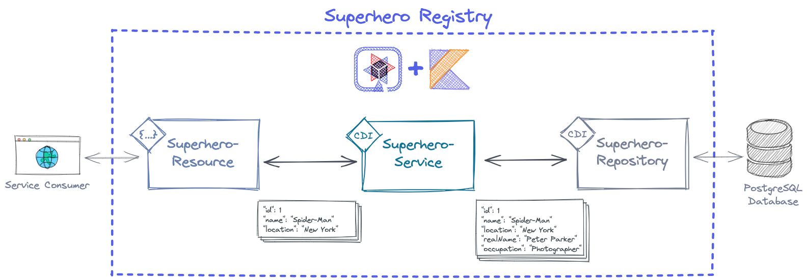
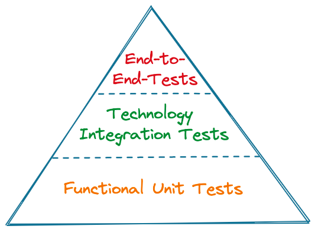

[](https://quarkus.io/)
[](https://kotlinlang.org/)
[](https://github.com/csh0711/quarkus-testautomation/actions/workflows/maven.yml)

# Test Automation with Quarkus

Example of a simple [Quarkus](https://quarkus.io/) application written in [Kotlin](https://kotlinlang.org/).
Shows how comprehensive **Test Automation** might be realized using
- [Junit 5](https://junit.org/junit5/)
- [MockK](https://mockk.io/)
- [Strikt](https://strikt.io/)
- [Testcontainers](https://www.testcontainers.org/)
- [Embedded H2](https://www.h2database.com/) 

## Overview
+ [The Quarkus/Kotlin application _Superhero Repository_](#the-quarkuskotlin-application-superhero-repository)
+ + [Running the application](#running-the-application)
+ + [Using the application](#using-the-application)
+ [Test Automation](#test-automation)
+ + [Executing the tests](#executing-the-tests)
+ [Further Hints](#further-hints)
+ + [Setup PostgreSQL with Docker to run the application](#setup-postgresql-with-docker-to-run-the-application)

## The Quarkus/Kotlin application Superhero Repository


The Quarkus/Kotlin application represents a _Superhero Repository_ where _Superheros_ might be stored and retrieved.

A _Superhero_ has these attributes:
- The Superhero name (e.g. _Batman_)
- The location (e.g. _Gotham City_)
- The real name  (e.g. _Bruce Wayne_)
- The occupation (e.g. _Businessman_)

The Quarkus/Kotlin application consists of three components:
1. The **_SuperheroResource_** providing the HTTP-/REST-API
2. The **_SuperheroService_** which realizes the business logic. 
To be precise it contains an "anonymization logic”: this makes sure that the real name and occupation of a 
Superhero can be stored tough but - in order to protect the Superhero's secret identity - this information will never 
be exposed afterwards.
3. The **_SuperheroRepository_** that encapsulates the access to the (PostgreSQL) database.

### Running the application

You can run the application in Quarkus' dev mode (what enables live coding) using:

```shell script
./mvnw -Dquarkus-profile=dev quarkus:dev 
```
The command above uses the `dev` profile (`-Dquarkus-profile=dev`) and starts the application with an embedded H2.

If, however, you want to use a _real_ PostgreSQL database instance, please start the app with the `prod` profile 
(`-Dquarkus-profile=prod`):

```shell script
./mvnw -Dquarkus-profile=prod quarkus:dev 
```
**Note:** If using the `prod` profile make sure to have a 
[PostgreSQL database](#setup-postgresql-with-docker-to-run-the-application) running as configured in the `"%prod":` 
section of the `application.yml`:

```yaml
"%prod":
  quarkus:
    datasource:
      db-kind: postgresql
      username: postgres
      password: mysecretpassword
      jdbc:
        driver: org.postgresql.Driver
        url: jdbc:postgresql://localhost:5432/superherodb
```

### Using the application

After successfully starting the application you can add a _Superhero_ with a `POST` request the endpoint
`http://localhost:8080/superheroes` like this:
```json
{
  "name": "Deadpool",
  "location": "Sedona",
  "realName": "Wade Winston Wilson",
  "occupation": "Mercenary"
}
```

The list of all (anomyized) _Superheros_ can be retrieved with a `GET` request to endpoint
`http://localhost:8080/superheroes`:
```json
[
  {
    "id": 1,
    "name": "Deadpool",
    "location": "Sedona"
  }
]
```

Or you can get a specific _Superhero_ by calling `http://localhost:8080/superheroes/{id}`.


**Note:** If you want a list of predefined _Superheros_ to be created automatically after starting the app just
uncomment the `initialize()` function call in the startup bean in `InitializeData.kt`:
```kotlin
constructor(superheroService: SuperheroService) {
  this.superheroService = superheroService
  initialize() // uncomment this line to create a list of Superheros after starting the app
}
```

## Test Automation
The "Test Pyramid" is a simplified model describing how software testing should be done in different levels of 
granularity and how many tests should be on which level. 
([see Cloud Native Testing: Spring Boot](https://github.com/test-automation-in-practice/cnt-spring-boot#testing-basics-with-junit-5-and-spring-boot))

Based on that generalized model, a test automation focused pyramid for backend applications could look 
something like this:



Testing the _Superhero Registry_ application requires tests of each group:
- **Function Unit Tests**: Test the core business logic and mock everything not immediate necessary (see 
`SuperheroServiceUnitTests.kt`). 
- **Technology Integration Tests**: Tests in this group are used to verify code written to use a particular technology
  (see `SuperheroResourceIntegrationTests.kt`)
- **End-to-End Tests**: Ensure that the entire control flow works from a consumer's request to the response.
Or to put it this way: Whether the interaction of all the components - tested isolated with Unit or Integration 
Tests - works as well (see `SuperheroRegistryEnd2EndTests.kt`).

### Executing the tests
The tests can be either executed directly within your IDE (e.g. in IntelliJ `Run` > `SuperheroServiceUnitTests.kt` etc.) 
or by running the corresponding Maven command:
```shell script
./mvnw test
```


Of course, it's also possible to use [Quarkus' Continuous Testing Mode](https://quarkus.io/guides/continuous-testing):
```shell script
./mvnw quarkus:test
```

**Note:** When executing the End-to-End test `SuperheroRegistryEnd2EndTests.kt` the PostgreSQL database is replaced with 
a [Tesctontainers](https://www.testcontainers.org/) instance. Therefore, a Docker daemon needs to be running on your 
machine. If for some reasons installing Docker daemon (e.g. with Docker Desktop) is not possible you should have have a 
look at [Testcontainers Cloud](https://www.testcontainers.cloud/).

## Further Hints

### Setup PostgreSQL with Docker to run the application
To provide a dockerized PostgreSQL when [running the application](#running-the-application) 
with the `prod` profile the following steps need to be executed:
```shell script
docker pull postgres  

docker run -p 5432:5432 --name postgres-db -e POSTGRES_PASSWORD=mysecretpassword -d postgres
```

